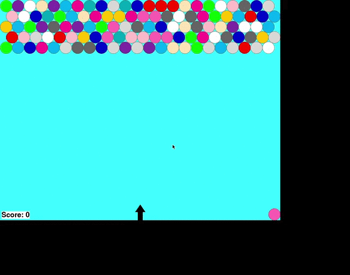

# 🫧 Python Bubble Shooter


A classic **Bubble Shooter arcade game** built entirely in Python using the Pygame library. Aim your launcher, fire coloured bubbles at the grid above, match three or more of the same colour to pop them, and clear the board before the bubbles reach the bottom!



---

## ✨ Features

- **Rotatable arrow launcher** — Use the left/right arrow keys to aim precisely before shooting.
- **Colour-matching pop mechanic** — Match 3 or more adjacent bubbles of the same colour to clear them, with a satisfying pop sound effect.
- **Floating bubble detection** — Bubbles that become disconnected from the main cluster after a pop automatically fall away, earning bonus clears.
- **Dynamic colour pool** — The next-bubble colour set updates in real time to only include colours still present on the board, keeping the game fair and winnable.
- **Next bubble preview** — See the upcoming bubble in the bottom-right corner so you can plan your shot.
- **Live score tracking** — Each popped bubble earns 10 points; score is displayed throughout the game.
- **Win & lose conditions** — Clear the entire board to win; lose if the bubble cluster descends to the launcher line.
- **Rotating soundtrack** — Three background music tracks (`Whatever It Takes`, `Goofy Theme`, `bgmusic`) play sequentially and loop automatically.
- **Replay without restarting** — After a win or loss, press `Enter` to instantly start a fresh game without closing the window.
- **Anti-aliased bubble rendering** — Smooth, clean circle graphics using `pygame.gfxdraw` for a polished look.

---

## 🏗️ Architecture Overview

The game follows a straightforward **object-oriented + procedural hybrid** design, organised around a central game loop.

```
┌─────────────────────────────────────────────────┐
│                    main()                        │
│   pygame init → display setup → game loop        │
└────────────────────┬────────────────────────────┘
                     │
          ┌──────────▼──────────┐
          │      rngame()        │  ← Core game loop
          │  event → update      │
          │  → draw → tick       │
          └──┬──────┬───────────┘
             │      │
     ┌───────▼─┐  ┌─▼──────┐
     │ Bubble  │  │  Ary   │   ← Sprite classes
     │ (shoot) │  │(arrow) │
     └───────┬─┘  └────────┘
             │
     ┌───────▼────────────────────┐
     │     Board Array (bbarr)    │
     │  20 rows × 25 cols grid    │
     │  each cell: Bubble | '.'   │
     └───────┬────────────────────┘
             │
     ┌───────▼──────────────────────────┐
     │  Collision & Pop Logic           │
     │  stbb() → popbb() (recursive)    │
     │  chkfflotrs() → popflotrs()      │
     └──────────────────────────────────┘
```

### Key Components

| Component | Description |
|-----------|-------------|
| `Bubble` class | Sprite for both flying and grid-locked bubbles. Handles angle-based movement, drawing, and position. |
| `Ary` class | The rotatable arrow launcher sprite. Rotates via `pygame.transform.rotate`. |
| `Score` class | Tracks and renders the running score. |
| `bbarr` (board array) | A 20×25 2D list representing the bubble grid. Cells contain either a `Bubble` object or `'.'` (blank). |
| `stbb()` | Collision detection — places a flying bubble into the correct grid cell on impact. |
| `popbb()` | Recursive flood-fill that collects all same-colour neighbours for a potential pop. |
| `chkfflotrs()` | Detects and removes bubbles floating (disconnected from the top row) after a pop. |
| `updtclrlist()` | Re-computes the set of colours remaining on the board for the next-bubble pool. |

---

## 🛠️ Tech Stack

| Layer | Technology |
|-------|------------|
| Language | Python 3.7+ |
| Game Engine | [Pygame](https://www.pygame.org/) 2.x |
| Graphics | `pygame.gfxdraw` (anti-aliased circles) |
| Audio | `pygame.mixer` (`.ogg` format) |
| Physics / Math | Python `math` module (angle/trig calculations) |
| State Management | In-memory 2D array + sprite objects |

---

## 📋 Prerequisites

Before running the game, make sure you have the following installed:

- **Python 3.7 or higher** — [Download Python](https://www.python.org/downloads/)
- **pip** — comes bundled with Python 3.4+
- **Pygame 2.x**

You can verify your Python version with:

```bash
python --version
# or on some systems:
python3 --version
```

---

## 🚀 Installation

### 1. Clone the repository

```bash
git clone https://github.com/luccy93/Python-Bubble-Shooter-game.git
cd Python-Bubble-Shooter-game
```

### 2. (Optional but recommended) Create a virtual environment

```bash
# Create the environment
python -m venv venv

# Activate it — macOS / Linux
source venv/bin/activate

# Activate it — Windows
venv\Scripts\activate
```

### 3. Install dependencies

```bash
pip install pygame
```

> **Note:** No `requirements.txt` is included in the repo. The only third-party dependency is `pygame`.

---

## ⚙️ Configuration

The game has no external config file. All tunable constants live at the top of `bubbleshooter.py`:

| Constant | Default | Description |
|----------|---------|-------------|
| `FPS` | `120` | Target frames per second |
| `winwdth` | `940` | Window width in pixels |
| `winhgt` | `740` | Window height in pixels |
| `bubblerad` | `20` | Radius of each bubble (pixels) |
| `bubblelyrs` | `5` | Number of pre-filled rows at game start |
| `arywdth` | `25` | Grid columns |
| `aryhgt` | `20` | Grid rows |
| `clrlist` | 14 colours | Full palette of possible bubble colours |

To change any of these, open `bubbleshooter.py` in your editor and modify the values near the top of the file.

---

## 💻 Running the Application

Make sure you are in the project directory and your virtual environment (if used) is active, then run:

```bash
python bubbleshooter.py
```

The game window (940 × 740 px) will open immediately and background music will begin playing.

---

## 📁 Project Structure

```
Python-Bubble-Shooter-game/
│
├── bubbleshooter.py          # Main game file — all logic, classes, and entry point
│
├── Arrow.png                 # Launcher arrow sprite image
├── bubbleshoot.gif           # Gameplay demo GIF (used in README)
│
├── bgmusic.ogg               # Background music track 1
├── Whatever_It _Takes_OGG.ogg # Background music track 2
├── Goofy_Theme.ogg           # Background music track 3
│
├── popcork.ogg               # Sound effect played when bubbles pop
│
└── README.md                 # Project documentation
```

All assets (images, audio) must remain in the **same directory** as `bubbleshooter.py` — the game loads them by relative filename.

---

## 🎮 Usage

### Controls

| Key | Action |
|-----|--------|
| `←` Left Arrow | Rotate launcher left |
| `→` Right Arrow | Rotate launcher right |
| `Space` | Fire bubble |
| `Enter` | Restart after game over |
| `Escape` | Quit the game |

### Gameplay Walkthrough

1. **Aim** — Hold the left or right arrow key to rotate the arrow launcher at the bottom-centre of the screen.
2. **Fire** — Press `Space` to launch a bubble in the direction the arrow is pointing.
3. **Bounce** — Bubbles bounce off the left and right walls, enabling angled trick shots.
4. **Match & Pop** — When your bubble lands adjacent to 2 or more bubbles of the same colour, all matching connected bubbles are removed and your score increases (+10 per bubble).
5. **Floaters** — Any bubbles left hanging (no longer connected to the top row) also disappear automatically.
6. **Win** — Clear every bubble from the board.
7. **Lose** — If any bubble in the grid touches the launcher line at the bottom, the game ends.
8. **Replay** — On the end screen, press `Enter` to play again or `Escape` to quit.

### Scoring

```
Each popped bubble  =  10 points
Floater bonus       =  10 points per floater removed
```

---

## 🧩 Code Deep-Dive

### Bubble movement (angle-based)

Bubbles travel at a constant speed of 10 px/frame. Direction is computed from the launch angle using standard trigonometry:

```python
xmove = math.cos(math.radians(angle)) * speed
ymove = math.sin(math.radians(angle)) * speed * -1  # negative = upward
```

Angles range from **0° (far right)** to **180° (far left)**. Straight up is **90°**.

### Wall bouncing

```python
if newbb.rect.right >= winwdth - 5:
    newbb.angle = 180 - newbb.angle   # reflect horizontally
elif newbb.rect.left <= 5:
    newbb.angle = 180 - newbb.angle
```

### Pop flood-fill (`popbb`)

A recursive depth-first search collects all bubbles of the same colour connected to the landing cell:

```python
def popbb(bbarr, row, col, color, dellst):
    # base cases: out of bounds, blank, wrong colour, already visited
    dellst.append((row, col))
    # recurse into all 6 hex-grid neighbours
```

If `len(dellst) >= 3`, all collected positions are blanked from the board.

### Hex-grid neighbour offsets

The board uses a **staggered hex grid** — odd rows are offset by half a bubble width. Neighbour offsets differ for even vs odd rows, which is why `popbb` and `popflotrs` both branch on `row % 2`.

---

## 🧪 Testing

There is no automated test suite in the current codebase. To manually verify behaviour:

| Test | How to check |
|------|-------------|
| Wall bounce | Aim at a sharp angle toward a wall and fire — bubble should reflect cleanly |
| 3-match pop | Land a bubble next to exactly 2 of the same colour — all 3 should disappear with a sound |
| Floater removal | Create a scenario where a pop disconnects a cluster from the top row — disconnected bubbles should vanish |
| Colour pool update | After several pops remove a colour entirely, that colour should no longer appear as a "next" bubble |
| Win condition | Clear all bubbles — end screen should read "You win!" |
| Lose condition | Let bubbles accumulate until they touch the bottom line — end screen should read "You lose!" |

To add automated tests in the future, consider extracting the pure logic functions (`popbb`, `chkfflotrs`, `updtclrlist`) into a separate module and using `pytest`.

---

## 🚢 Deployment

This is a **desktop application** — distribution options include:

### Option 1 — Share source (simplest)

Recipients clone the repo and run `python bubbleshooter.py` after installing Pygame.

### Option 2 — Package as a standalone executable with PyInstaller

```bash
# Install PyInstaller
pip install pyinstaller

# Bundle everything into a single executable
pyinstaller --onefile --windowed \
  --add-data "Arrow.png:." \
  --add-data "bubbleshoot.gif:." \
  --add-data "bgmusic.ogg:." \
  --add-data "Goofy_Theme.ogg:." \
  --add-data "Whatever_It _Takes_OGG.ogg:." \
  --add-data "popcork.ogg:." \
  bubbleshooter.py
```

The output executable will be in `dist/bubbleshooter` (Linux/macOS) or `dist/bubbleshooter.exe` (Windows). No Python or Pygame installation required on the target machine.

### Option 3 — Package with cx_Freeze or Nuitka

Similar to PyInstaller but may produce smaller or faster binaries for specific platforms.

---

## 🔒 Security Considerations

As a local desktop game with no networking, server, or user-data storage, the security surface is minimal:

- **No network calls** — the game is entirely offline.
- **No file writes** — scores are not persisted; nothing is written to disk during gameplay.
- **Asset loading** — all assets are loaded by relative path at startup. Ensure you run the script from the project directory to avoid `FileNotFoundError`.
- **Dependency hygiene** — keep Pygame updated: `pip install --upgrade pygame`.

---

## 📊 Monitoring and Logging

The game does not implement logging by default. To add basic diagnostics during development, insert standard Python logging at the top of `bubbleshooter.py`:

```python
import logging
logging.basicConfig(level=logging.DEBUG, format='%(asctime)s %(message)s')
```

Useful events to log: bubble placement (row/col), pop counts, colour pool updates, and music track changes.

**Performance:** The FPS clock is set to 120 FPS (`fpsclock.tick(FPS)`). On low-spec hardware, reduce `FPS` to `60` to ease CPU usage.

---

## 🗺️ Roadmap

Potential enhancements for future versions:

- [ ] **Persistent high score** — save and load top scores to/from a local file
- [ ] **Difficulty levels** — Easy / Medium / Hard with varying starting bubble layers and drop speed
- [ ] **Animated pops** — particle burst effect when bubbles are cleared
- [ ] **Touch / mouse support** — click to aim and shoot for mouse-only play
- [ ] **Level progression** — pre-designed puzzle levels with increasing complexity
- [ ] **Power-up bubbles** — special bubbles (bomb, wildcard, multiball)
- [ ] **requirements.txt / pyproject.toml** — proper dependency declaration
- [ ] **Automated test suite** — pytest unit tests for core logic functions
- [ ] **Pause menu** — ability to pause and resume mid-game

---

## 🤝 Contributing

Contributions are welcome! Here's how to get involved:

1. **Fork** the repository on GitHub.
2. **Create a feature branch:**
   ```bash
   git checkout -b feature/your-feature-name
   ```
3. **Make your changes** and test them thoroughly.
4. **Commit** with a clear message:
   ```bash
   git commit -m "feat: add animated bubble pop effect"
   ```
5. **Push** to your fork:
   ```bash
   git push origin feature/your-feature-name
   ```
6. **Open a Pull Request** against the `main` branch and describe what your change does and why.

Please keep PRs focused — one feature or fix per PR makes review much faster.

---

## 📄 License

This project is licensed under the **MIT License** — you are free to use, modify, and distribute this software, provided the original copyright notice is retained.

See [LICENSE](LICENSE) for the full text.

---

## 📬 Contact

**Repository:** [github.com/luccy93/Python-Bubble-Shooter-game](https://github.com/luccy93/Python-Bubble-Shooter-game)

Found a bug or have a suggestion? [Open an issue](https://github.com/luccy93/Python-Bubble-Shooter-game/issues) on GitHub.

---

*Built with 🫧 and Python.*
